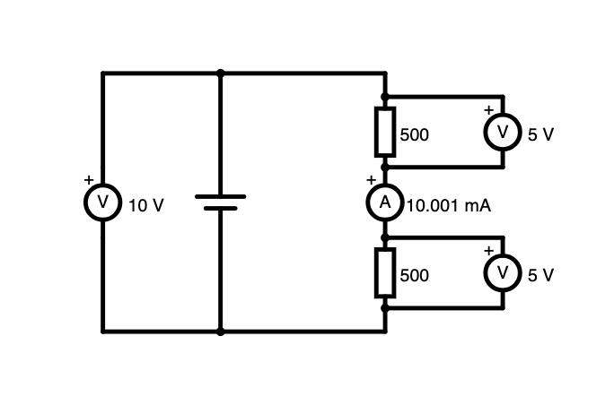

# Lernschritt 4: Reihenschaltung
## 🎯 Handlungssituation: LED-Statusanzeigen verkabeln

Der Netzwerktechniker benötigt deine Hilfe bei der Installation von Status-LEDs für die Serverracks. Die LEDs sollen in Reihe geschaltet werden, um Kabel zu sparen. Du musst verstehen, wie sich Spannung, Strom und Widerstand in Reihenschaltungen verhalten, um die richtige Anzahl LEDs pro Stromkreis zu berechnen.

**Deine heutige Aufgabe:**
- Verstehen, wie Reihenschaltungen funktionieren
- LED-Ketten richtig dimensionieren  
- Ausfallsicherheit von Reihenschaltungen bewerten
- Spannungsaufteilung in Reihenschaltungen berechnen

## 📖 Fachwissen: Reihenschaltung

### Was ist eine Reihenschaltung?

In einer **[Reihenschaltung](https://falstad.com/circuit/circuitjs.html?ctz=CQAgLCAMB0l3BWEBGGAmOaDsWDMkAONANgE5SsQFIqqaEBTAWmWQCgA3EDAkfCHijS8aNMDVRQpMBGwDu3QkN64MyqGwBOfNcjARVE0minVIWnTTTjL3AiLrmFh9S70Qnt-opWQPbAAdwOG4bcSt7PmkUeFj5YKsbF2tRePC7FTVhETSQ5GNbfJNPdPdC-Q0g0orSgtxo1Fi4eOTIl29zIORhFALu3hSo0Rimz37ek3HxsZ7B8Y74+b8fPmWZ3nHBabZcLBo3Oqyk6TYgA)** sind alle Bauteile in einer **einzigen Linie** hintereinander geschaltet. Der Strom hat nur **einen Weg**.



```
Batterie (+) → R1 → R2 → R3 → Batterie (-)
```

### Gesetze der Reihenschaltung

Verändere die Widerstandswerte in der **[Reihenschaltung](https://falstad.com/circuit/circuitjs.html?ctz=CQAgLCAMB0l3BWEBGGAmOaDsWDMkAONANgE5SsQFIqqaEBTAWmWQCgA3EDAkfCHijS8aNMDVRQpMBGwDu3QkN64MyqGwBOfNcjARVE0minVIWnTTTjL3AiLrmFh9S70Qnt-opWQPbAAdwOG4bcSt7PmkUeFj5YKsbF2tRePC7FTVhETSQ5GNbfJNPdPdC-Q0g0orSgtxo1Fi4eOTIl29zIORhFALu3hSo0Rimz37ek3HxsZ7B8Y74+b8fPmWZ3nHBabZcLBo3Oqyk6TYgA)** und überprüfe die folgenden Aussagen:

#### 1. Strom ist überall gleich
```
I_gesamt = I₁ = I₂ = I₃ = ...
```
**Warum?** Der Strom kann nicht "verschwinden" - was reingeht, muss auch wieder rauskommen.

#### 2. Spannungen addieren sich
```
U_gesamt = U₁ + U₂ + U₃ + ...
```
**Warum?** Jedes Bauteil "verbraucht" einen Teil der Gesamtspannung.

#### 3. Widerstände addieren sich
```
R_gesamt = R₁ + R₂ + R₃ + ...
```
**Warum?** Jeder Widerstand ist ein zusätzliches Hindernis für den Strom.

### Vor- und Nachteile der Reihenschaltung

**Vorteile:**
✅ Wenig Kabel nötig
✅ Einfacher Aufbau
✅ Geringer Stromverbrauch möglich

**Nachteile:**
❌ Fällt ein Bauteil aus → alles aus (Weihnachtsbaum-Effekt)
❌ Alle Bauteile haben gleichen Strom
❌ Spannungsaufteilung kann problematisch sein

## 🔧 Tinkercad-Übung 1: Drei LEDs in Reihe

### Schaltung aufbauen

```
9V Batterie (+) → R (470Ω) → LED₁ → LED₂ → LED₃ → Batterie (-)
```

### Komponenten:
- 1× 9V Batterie
- 3× LEDs (rot)
- 1× Widerstand 470Ω
- Multimeter
- Verbindungsdrähte

### Messungen durchführen:

1. **Gesamtstrom messen (an verschiedenen Stellen):** _____ A
2. **Strom nach LED₁:** _____ A  
3. **Strom nach LED₂:** _____ A
4. **Strom nach LED₃:** _____ A

**Beobachtung:** Ist der Strom überall gleich? ☐ Ja ☐ Nein

### Spannungsmessungen:

5. **Spannung über LED₁:** _____ V
6. **Spannung über LED₂:** _____ V  
7. **Spannung über LED₃:** _____ V
8. **Spannung über Widerstand:** _____ V
9. **Gesamtspannung:** _____ V

**Rechnung:** U₁ + U₂ + U₃ + U_R = _____ V (sollte 9V ergeben)

## 🔧 Tinkercad-Übung 2: Widerstandsreihe

Baue eine Reihenschaltung mit drei verschiedenen Widerständen:

```
9V Batterie (+) → R₁ (220Ω) → R₂ (470Ω) → R₃ (1kΩ) → Batterie (-)
```

### Berechnungen VOR der Messung:
1. **Gesamtwiderstand:** R<sub>ges</sub> = 220Ω + 470Ω + 1000Ω = _____ Ω
2. **Erwarteter Strom:** I = U / R_ges = 9V / _____ Ω = _____ A

### Messungen:
3. **Tatsächlicher Strom:** _____ A
4. **Spannung über R₁ (220Ω):** _____ V
5. **Spannung über R₂ (470Ω):** _____ V  
6. **Spannung über R₃ (1kΩ):** _____ V

**Beobachtung:** An welchem Widerstand liegt die höchste Spannung? _____

## 🧮 Rechenübungen

### Aufgabe 1: LED-Kette dimensionieren
Du willst 5 LEDs in Reihe an 12V betreiben. Jede LED benötigt 2V und 20mA.

**Gegeben:**
- Versorgungsspannung: U_ges = 12V
- LEDs: 5 Stück, je U_LED = 2V, I_LED =20mA
- Gesucht: Vorwiderstand

**Lösung:**
1. **Spannung aller LEDs:** U_LEDges = 5 × 2V = _____ V
2. **Spannung am Vorwiderstand:** U_Rvor = 12V - _____ V = _____ V  
3. **Strom durch die Schaltung:** I_ges = _____ mA = _____ A
4. **Vorwiderstand:** R = U / I = _____ V / _____ A = _____ Ω

### Aufgabe 2: Spannungsteiler berechnen
Eine Reihenschaltung aus R₁ = 2kΩ und R₂ = 3kΩ wird an 15V angeschlossen.

**Gesucht:** 
a) Gesamtstrom
b) Spannung über R₁
c) Spannung über R₂

**Lösung:**
a) R_ges = 2kΩ + 3kΩ = _____ kΩ = _____ Ω
   I = U / R = 15V / _____ Ω = _____ A

b) U₁ = I × R₁ = _____ A × 2000Ω = _____ V

c) U₂ = I × R₂ = _____ A × 3000Ω = _____ V

**Kontrollrechnung:** U₁ + U₂ = _____ V + _____ V = 15V ✓

### Aufgabe 3: Server-Rack Beleuchtung
Ein Server-Rack soll mit LED-Streifen beleuchtet werden. Verfügbar sind 24V.

**Gegeben:**
- 8 LEDs in Reihe
- Jede LED: 3V, 25mA
- Gesucht: Ist ein Vorwiderstand nötig?

**Lösung:**
- Spannung aller LEDs: 8 × 3V = _____ V
- Verfügbare Spannung: 24V
- **Antwort:** _____ (Ja/Nein), weil _____

## 🎯 Praktisches Anwendungsbeispiel: Serverraum-Notbeleuchtung

**Situation:** Die Notbeleuchtung im Serverraum soll erneuert werden. Statt teurer Einzellampen sollen LED-Ketten verwendet werden.

**Anforderungen:**
- Versorgung: 48V DC (USV-Anlage)
- LEDs: 3,2V, 30mA
- Gewünschte Helligkeit: mindestens 12 LEDs pro Stromkreis

### Berechnung:

1. **Maximale LED-Anzahl bei 48V:**
   - Anzahl = 48V / 3,2V = _____ LEDs (aufgerundet auf ganze Zahl)

2. **Tatsächliche Spannung von 15 LEDs:**
   - U_LEDs = 15 × 3,2V = _____ V

3. **Restspannung:**
   - U_Rest = 48V - _____ V = _____ V

4. **Ist ein Vorwiderstand nötig?**
   - ☐ Ja, R = _____ Ω
   - ☐ Nein, Spannung passt genau

5. **Ausfallsicherheit bewerten:**
   - Bei Ausfall einer LED: ☐ Alle LEDs aus ☐ Nur eine LED aus
   - **Verbesserungsvorschlag:** _____

## ⚠️ Probleme bei Reihenschaltungen

### 1. Der "Weihnachtsbaum-Effekt"
- **Problem:** Eine defekte LED → ganze Kette aus
- **Lösung:** Parallelschaltung oder LED-Überbrückung

### 2. Unterschiedliche Bauteile
- **Problem:** LEDs haben leicht unterschiedliche Eigenschaften
- **Folge:** Eine LED kann überlastet werden
- **Lösung:** LEDs aus gleicher Produktion verwenden

### 3. Spannungsaufteilung
- **Problem:** Spannung teilt sich proportional zu den Widerständen
- **Folge:** Hoher Widerstand → hohe Spannung
- **Vorsicht:** Bauteil kann überlastet werden!

## ✅ Selbstüberprüfung

1. **In einer Reihenschaltung ist der Strom:**
   ☐ überall gleich
   ☐ überall unterschiedlich
   ☐ am Ende am größten

2. **In einer Reihenschaltung addieren sich:**
   ☐ nur die Spannungen
   ☐ nur die Widerstände  
   ☐ sowohl Spannungen als auch Widerstände

3. **Fällt in einer Reihenschaltung ein Bauteil aus:**
   ☐ arbeiten alle anderen weiter
   ☐ fällt die ganze Schaltung aus
   ☐ wird die Schaltung heller

4. **Der Gesamtwiderstand einer Reihenschaltung ist:**
   ☐ kleiner als der kleinste Einzelwiderstand
   ☐ größer als der größte Einzelwiderstand
   ☐ der Mittelwert aller Widerstände

## 🎯 Lösungen

### Rechenübungen:
1. **LED-Kette:** Spannung LEDs: 10V, am Widerstand: 2V, R = 100Ω
2. **Spannungsteiler:** a) I = 3mA, b) U₁ = 6V, c) U₂ = 9V  
3. **Server-Rack:** Spannung LEDs: 24V, **Nein**, passt genau

### Serverraum-Beispiel:
1. **Max. LEDs:** 15 LEDs
2. **Spannung 15 LEDs:** 48V  
3. **Restspannung:** 0V
4. **Vorwiderstand:** Nein, nicht nötig
5. **Ausfallsicherheit:** Alle LEDs aus → Problem!

### Selbstüberprüfung:
1. ✅ überall gleich
2. ✅ sowohl Spannungen als auch Widerstände
3. ✅ fällt die ganze Schaltung aus
4. ✅ größer als der größte Einzelwiderstand

---

## 📝 Notizen

```
Meine Erkenntnisse zu Reihenschaltungen:
- Strom ist überall gleich: I₁ = I₂ = I₃
- Spannungen addieren sich: U_ges = U₁ + U₂ + U₃  
- Widerstände addieren sich: R_ges = R₁ + R₂ + R₃
- Problem: Ein Ausfall → alles aus

Anwendungen in der IT:
- LED-Ketten (aber Ausfallrisiko!)
- Spannungsteiler
- Messschaltungen
```

**▶️ Reihenschaltung verstanden? Weiter zur Parallelschaltung in Lernschritt 5!**
