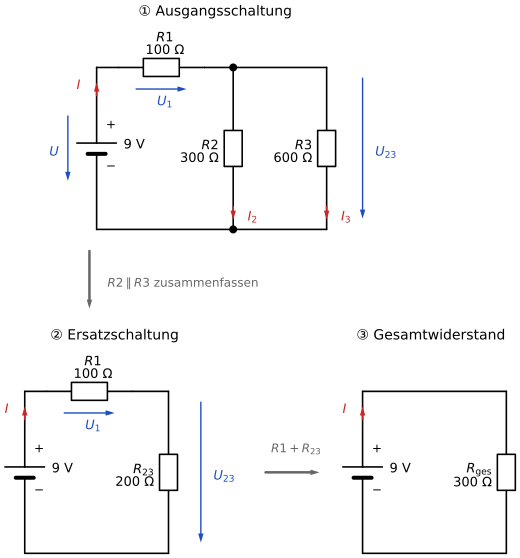

# Lernschritt 6 – Wissensbaustein: Gemischte Schaltungen berechnen

Eine **gemischte Schaltung** enthält Reihen- **und** Parallelschaltungen.
Du berechnest sie in zwei Richtungen:

- **Vereinfachen:** Fasse die Schaltung Schritt für Schritt zusammen, bis nur noch ein Widerstand übrig ist.
- **Zurückrechnen:** Berechne von dort aus alle Spannungen und Ströme.

## Vorgehen in vier Schritten

Beispiel: U = 9 V, R₁ = 100 Ω, R₂ = 300 Ω, R₃ = 600 Ω

| Schritt | Was tust du? | Beispiel |
|---|---|---|
| ① Zusammenfassen | Parallelgruppe durch einen Ersatzwiderstand ersetzen | R₂₃ = (300 Ω · 600 Ω) / (300 Ω + 600 Ω) = 200 Ω |
| ② Gesamtwiderstand | Widerstände in Reihe addieren | R_ges = R₁ + R₂₃ = 100 Ω + 200 Ω = 300 Ω |
| ③ Gesamtstrom | Ohmsches Gesetz | I = U / R_ges = 9 V / 300 Ω = 30 mA |
| ④ Zurückrechnen | erst die Spannungen … | U₁ = R₁ · I = 3 V  U₂₃ = R₂₃ · I = 6 V |
| | … dann die Teilströme | I₂ = U₂₃ / R₂ = 20 mA  I₃ = U₂₃ / R₃ = 10 mA |

Die Formel „Produkt durch Summe“ gilt nur für **zwei** parallele Widerstände:

$$R_{23} = \frac{R_2 \cdot R_3}{R_2 + R_3}$$

## Kontrolle: Kirchhoff'sche Regeln

| Regel | Aussage | Beispiel |
|---|---|---|
| **Maschenregel** | Auf **einem** Weg von + nach − ergeben die Teilspannungen zusammen die Quellenspannung. | U₁ + U₂₃ = 3 V + 6 V = 9 V ✓ |
| **Knotenregel** | Was in einen Knoten hineinfließt, fließt auch wieder heraus. | I = I₂ + I₃ → 30 mA = 20 mA + 10 mA ✓ |

## Merke

- **R1 führt den Gesamtstrom.** Ändert sich etwas in einem Zweig, ändern sich I, U₁ **und** U₂₃.
  Das ist anders als bei der reinen Parallelschaltung aus Lernschritt 5.
- An der Parallelgruppe liegt **nicht** die volle Quellenspannung, sondern nur U₂₃.
  Typischer Fehler: I₂ = 9 V / R₂ rechnen.
- U₂ und U₃ sind **dieselbe** Spannung (U₂₃). Deshalb gilt **nicht**: U₁ + U₂ + U₃ = U.

---

**Weiter:** [Zurück zum Auftrag](./Handlungssituation.md) · [Übungen](./Uebungen_H5P.md)
