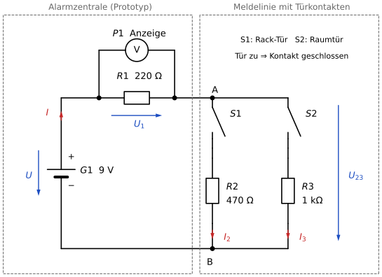

# Lernschritt 6 – Alarmzentrale: Welche Tür ist offen?

> **Kundenauftrag an die NetSys GmbH:** Der Serverraum eines Kunden soll eine einfache Alarmzentrale bekommen. Überwacht werden die **Rack-Tür** (S1) und die **Raumtür** (S2).
> Die Zentrale misst nur **eine einzige Spannung**: U₁ am Widerstand R1.
> Daran soll sie erkennen, **welche** Tür offen ist.
>
> Deine Ausbilderin gibt dir den Schaltplan des Prototyps. Du erstellst das **Prüfprotokoll**: Welche Anzeige gehört zu welchem Türzustand?

**Simulation zum Prüfen:** [Versuch 06 – Alarmzentrale](../versuche/06_gemischte_schaltung.html) (Klick auf S1 oder S2 öffnet die Tür)

---

## Dein Auftrag

1. **Analysieren:** Beide Türen sind zu. Welche Widerstände liegen in Reihe, welche parallel? Markiere im Schaltplan mit zwei Farben.
2. **Berechnen:** Fülle Teil A aus. Wie das geht, steht im [Wissensbaustein](./Fachwissen.md).
3. **Prüfen:** Vergleiche deine Werte mit der Simulation. Stimmen die Knoten- und die Maschenregel?
4. **Zustände:** Fülle Teil B aus: Was zeigt die Zentrale bei jedem Türzustand an?
5. **Bewerten:** Beantworte Teil C.

Arbeitet zu zweit. Wechselt euch ab: Eine Person rechnet, die andere prüft.

---

## Prüfprotokoll

**Teil A – Normalzustand (beide Türen zu)**

| Größe | berechnet | Simulation |
|---|---|---|
| R₂₃ (Ersatzwiderstand R2 ∥ R3) | | – |
| R_ges | | – |
| I (Gesamtstrom) | | |
| U₁ (Anzeige der Zentrale) | | |
| U₂₃ | | |
| I₂ (durch R2) | | |
| I₃ (durch R3) | | |

Kontrolle: U₁ + U₂₃ = ______ V  I₂ + I₃ = ______ mA

**Teil B – Auswertetabelle für die Zentrale**

| Zustand | S1 Rack-Tür | S2 Raumtür | Anzeige U₁ | Meldung |
|---|---|---|---|---|
| 1 | zu | zu | | „Alles in Ordnung“ |
| 2 | offen | zu | | |
| 3 | zu | offen | | |
| 4 | offen | offen | | |
| 5 | Sabotage: Leitung zwischen A und B kurzgeschlossen | | | |

**Teil C – Bewertung**

Kann die Zentrale alle fünf Zustände sicher voneinander unterscheiden? Begründe in zwei bis drei Sätzen.

*Satzanfang:* „Die Zentrale kann … unterscheiden, weil …“

---

## Für Schnelle (Additum)

- **A1 – Entscheiden:** Für R1 ist ein Widerstand mit 0,25 W Belastbarkeit eingeplant. Hält er alle fünf Zustände aus? Entscheide, welchen Typ du bestellst, und begründe. *(Erinnerung an LS 3: P = U · I)*
- **A2 – Bewerten:** Bei „beide Türen offen“ und bei „Kabel durchgeschnitten“ zeigt die Zentrale denselben Wert. Ist das ein Sicherheitsproblem? Begründe.

---

## Hilfekarten

Öffne eine Karte nur, wenn du nicht weiterkommst. Fang immer mit der ersten an.

🟢 Hilfe 1: Wohin fließt der Strom?

Bei geschlossener Tür ist der Schalter einfach ein Stück Draht. Fahre mit dem Finger vom Pluspol aus den Leitungen nach:
Wo teilt sich der Strom auf? Wo fließt er wieder zusammen? Fließt durch R1 **ein Teil** des Stroms oder **der ganze**?

🟡 Hilfe 2: In welcher Reihenfolge rechnen?

1. Ersetze die Parallelgruppe R2 ∥ R3 durch **einen** Ersatzwiderstand R₂₃.
2. Jetzt liegen nur noch R1 und R₂₃ in Reihe → R_ges.
3. Gesamtstrom mit dem ohmschen Gesetz.
4. Zurückrechnen: erst die Spannungen U₁ und U₂₃, dann die Teilströme I₂ und I₃.

🟠 Hilfe 3: Der erste Schritt

R₂₃ = (470 Ω · 1000 Ω) / (470 Ω + 1000 Ω) ≈ 320 Ω

Die Schaltung besteht jetzt nur noch aus R1 = 220 Ω und R₂₃ ≈ 320 Ω in Reihe. Wie groß ist R_ges, und welcher Strom I fließt damit?

🔴 Hilfe 4: Selbstkontrolle

- R_ges muss größer als R1 und kleiner als R1 + R2 sein.
- I liegt zwischen 10 mA und 20 mA.
- U₁ + U₂₃ = 9 V und I₂ + I₃ = I?
- I₂ ist größer als I₃, weil R2 kleiner ist als R3.

💡 Hilfe zu Teil B: Eine Tür ist offen

Ein offener Schalter unterbricht seinen Zweig. Dieser Zweig fällt also weg.
Zeichne die Schaltung ohne diesen Zweig. Welche Schaltungsart bleibt übrig? Die kennst du aus Lernschritt 4.

---

**Weiter:** [Wissensbaustein](./Fachwissen.md) · [Übungen](./Uebungen_H5P.md) · [Ich-kann-Liste](./Ich_kann_Liste.md)
