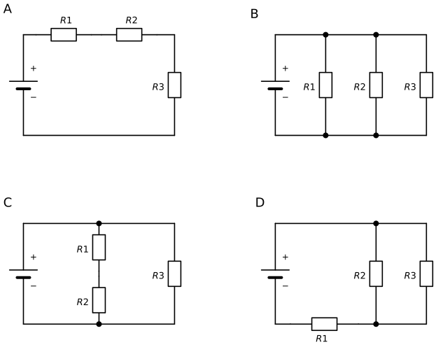

# Lernschritt 6 – Übungen

> Die Übungen sind in LiaScript-Syntax geschrieben und im LiaScript-Kurs interaktiv.
> Für Moodle liegen die Übungen 3 bis 6 zusätzlich als H5P-Dateien vor: [`h5p/generated/`](./h5p/generated/)

## Übung 1 – Schaltungen erkennen

**a) Welche Schaltungen sind gemischte Schaltungen?**

- [[ ]] A
- [[ ]] B
- [[X]] C
- [[X]] D
****
C: R1 und R2 liegen in Reihe, zusammen parallel zu R3.
D: R2 ∥ R3, und R1 liegt in Reihe dazu. Ob R1 oben oder in der Rückleitung gezeichnet ist, ändert nichts.
****

**b) In welchen Schaltungen fließt durch R1 der Gesamtstrom?**

- [[X]] A
- [[ ]] B
- [[ ]] C
- [[X]] D
****
Durch R1 fließt der Gesamtstrom, wenn er in keinem Zweig liegt: In A gibt es nur einen Weg. In D muss der ganze Strom über die Rückleitung durch R1 zurück.
****

## Übung 2 – Die passende Formel

**Welche Formel gilt für Schaltung C?**

- [( )] $R_{ges} = R_1 + R_2 + R_3$
- [( )] $R_{ges} = R_1 + \frac{R_2 \cdot R_3}{R_2 + R_3}$
- [(X)] $R_{ges} = \frac{(R_1 + R_2) \cdot R_3}{R_1 + R_2 + R_3}$
- [( )] $R_{ges} = \frac{1}{1/R_1 + 1/R_2 + 1/R_3}$

**Welche Formel gilt für Schaltung D?**

- [( )] $R_{ges} = R_1 + R_2 + R_3$
- [(X)] $R_{ges} = R_1 + \frac{R_2 \cdot R_3}{R_2 + R_3}$
- [( )] $R_{ges} = \frac{(R_1 + R_2) \cdot R_3}{R_1 + R_2 + R_3}$
- [( )] $R_{ges} = \frac{1}{1/R_1 + 1/R_2 + 1/R_3}$

## Übung 3 – Vorhersage: Die Raumtür geht auf

In der Alarmzentrale sind beide Türen zu. Jetzt wird die **Raumtür** geöffnet (S2 offen).
Was passiert? Entscheide **ohne** zu rechnen. Mehrere Antworten sind richtig.

- [[X]] Der Gesamtstrom I wird kleiner.
- [[X]] Die Anzeige U₁ wird kleiner.
- [[X]] Die Spannung U₂₃ an R2 wird größer.
- [[ ]] Der Strom I₂ durch R2 bleibt gleich.
****
Ein Zweig fällt weg, also wird R_ges größer und I kleiner. Damit sinkt U₁ = R₁ · I.
Für R2 bleibt mehr Spannung übrig (U₂₃ = 9 V − U₁), deshalb steigt auch I₂.
Die Zweige beeinflussen sich hier gegenseitig – wegen R1. In der reinen Parallelschaltung aus LS 5 war das nicht so.
****

## Übung 4 – Neue Platine, gleiche Methode

Eine Statusanzeige: U = 9 V, R1 = 330 Ω in Reihe mit R2 = 1 kΩ ∥ R3 = 1 kΩ.

Gesamtstrom: I = [[ 3,9 mA | (10,8 mA) | 18,0 mA | 27,3 mA ]]

Anzeige an R1: U₁ = [[ 1,3 V | (3,6 V) | 5,4 V | 9,0 V ]]

Strom durch R2: I₂ = [[ (5,4 mA) | 9,0 mA | 10,8 mA ]]
[[?]] Zwei gleiche Widerstände parallel ergeben die Hälfte eines Widerstands.
[[?]] An R2 liegt nicht die volle Spannung von 9 V, sondern nur U₂₃.
****
R₂₃ = 1000 Ω / 2 = 500 Ω → R_ges = 830 Ω → I = 9 V / 830 Ω ≈ 10,8 mA
U₁ = 330 Ω · 10,8 mA ≈ 3,6 V → U₂₃ = 9 V − 3,6 V = 5,4 V → I₂ = 5,4 V / 1 kΩ = 5,4 mA
****

## Übung 5 – Fehlersuche

Ein Kollege hat die Alarmzentrale aufgebaut. Beide Türen sind zu.
Erwartet: U₁ = 3,67 V und I = 16,7 mA. Gemessen: **U₁ = 1,17 V** und **I = 5,3 mA**.

**Welcher Aufbaufehler erklärt die Messwerte?**

- [( )] R1 ist unterbrochen.
- [( )] Die Rack-Tür ist doch offen.
- [(X)] R2 und R3 sind in Reihe statt parallel geschaltet.
- [( )] Die Leitung zwischen A und B ist kurzgeschlossen.
[[?]] Berechne aus den Messwerten den Gesamtwiderstand: R_ges = U / I.
****
R_ges = 9 V / 5,3 mA ≈ 1,7 kΩ. Das passt zu 220 Ω + 470 Ω + 1000 Ω = 1690 Ω: R2 und R3 liegen in Reihe.
Zum Vergleich: R1 unterbrochen ergibt 0 mA, Rack-Tür offen ergibt 7,4 mA, Kurzschluss ergibt 40,9 mA.
****

## Übung 6 – Richtig oder falsch?

- [(richtig) (falsch)]
- [  (X)       ( )   ]  In der Alarmzentrale fließt durch R1 immer der Gesamtstrom.
- [  ( )       (X)   ]  An jedem Zweig der Parallelgruppe liegt die volle Quellenspannung von 9 V.
- [  ( )       (X)   ]  Es gilt: U₁ + U₂ + U₃ = U.
- [  (X)       ( )   ]  R_ges ist größer als R1, aber kleiner als R1 + R2.
****
2: An der Parallelgruppe liegt nur U₂₃ = U − U₁.
3: U₂ und U₃ sind dieselbe Spannung U₂₃. Richtig ist: U₁ + U₂₃ = U.
4: R₂₃ ist kleiner als der kleinste Widerstand der Gruppe (R2). Deshalb gilt R1 < R_ges < R1 + R2.
****

---

**Zurück:** [Auftrag](./Handlungssituation.md) · **Weiter:** [Ich-kann-Liste](./Ich_kann_Liste.md)
